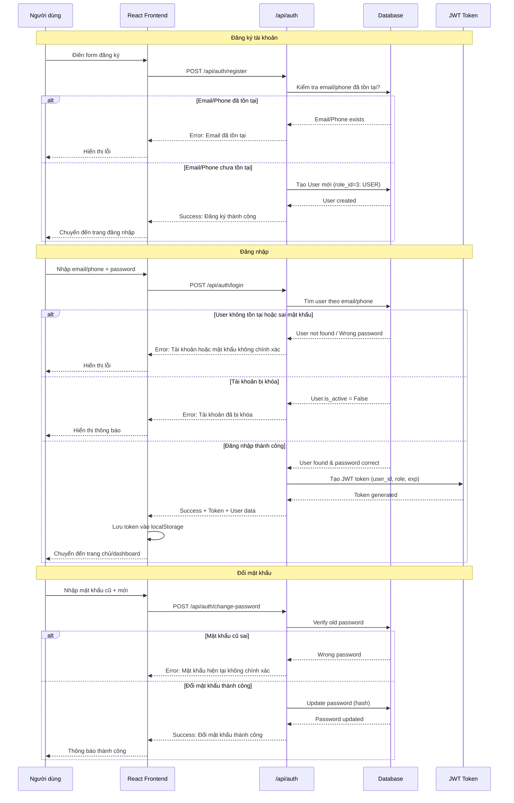
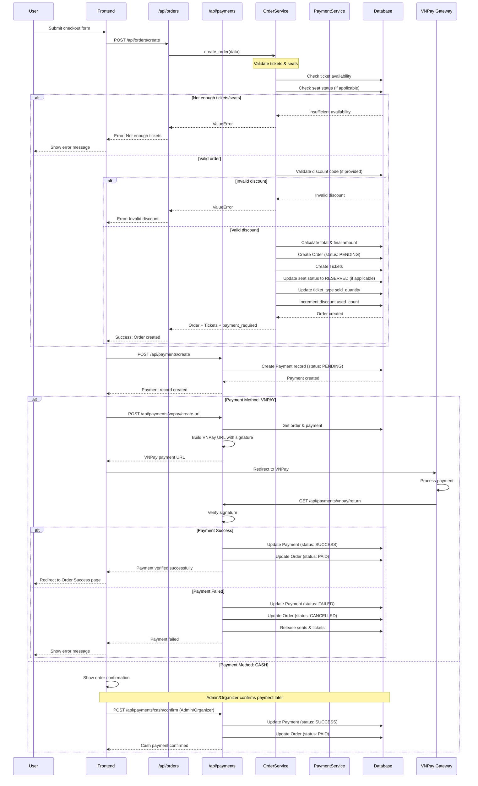
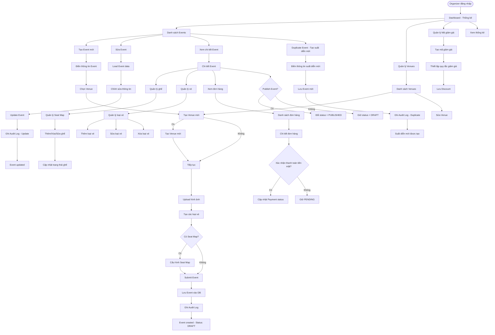
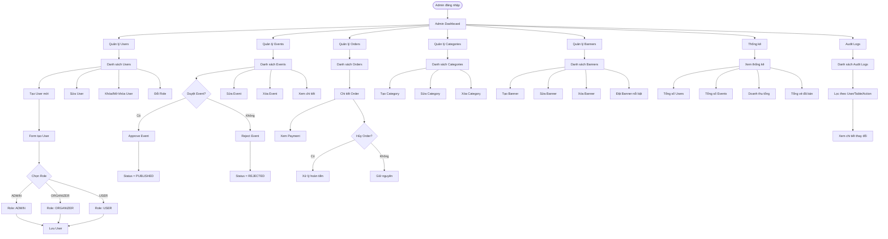
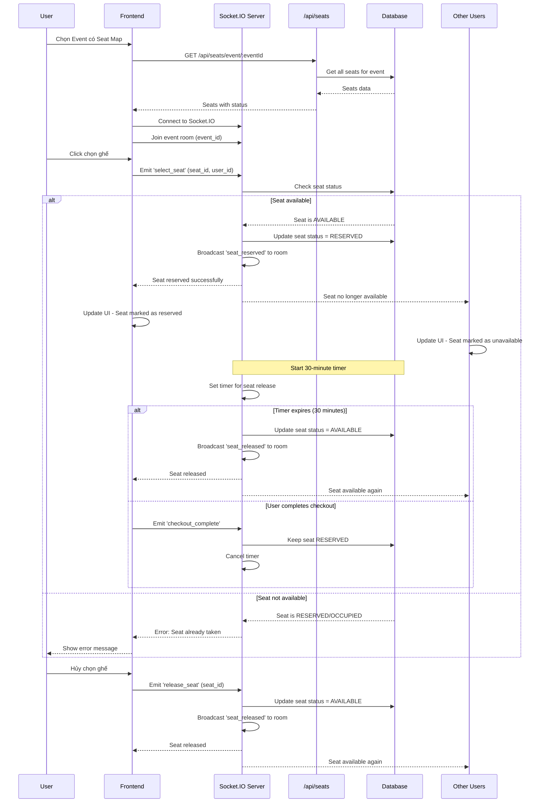
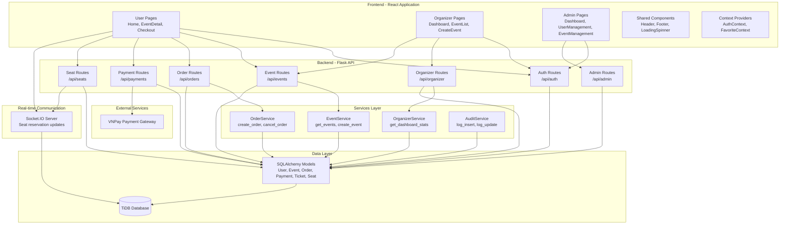
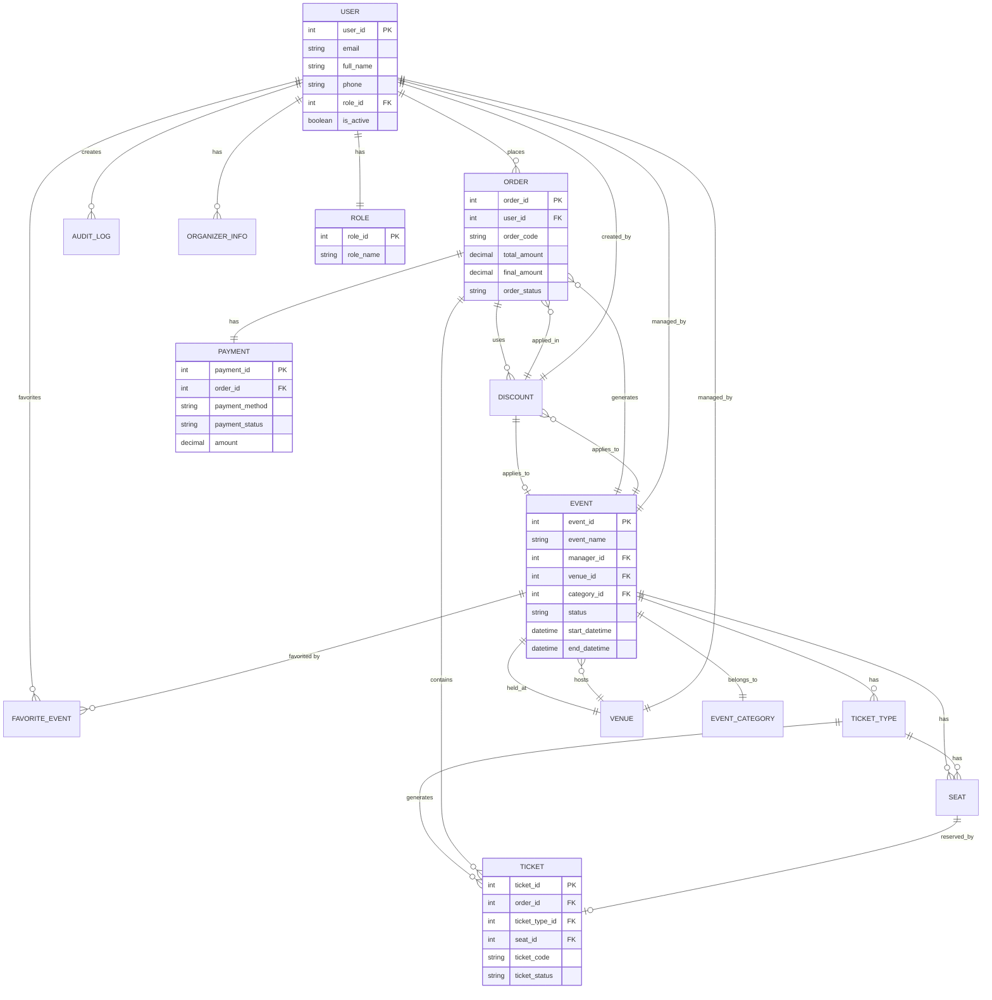
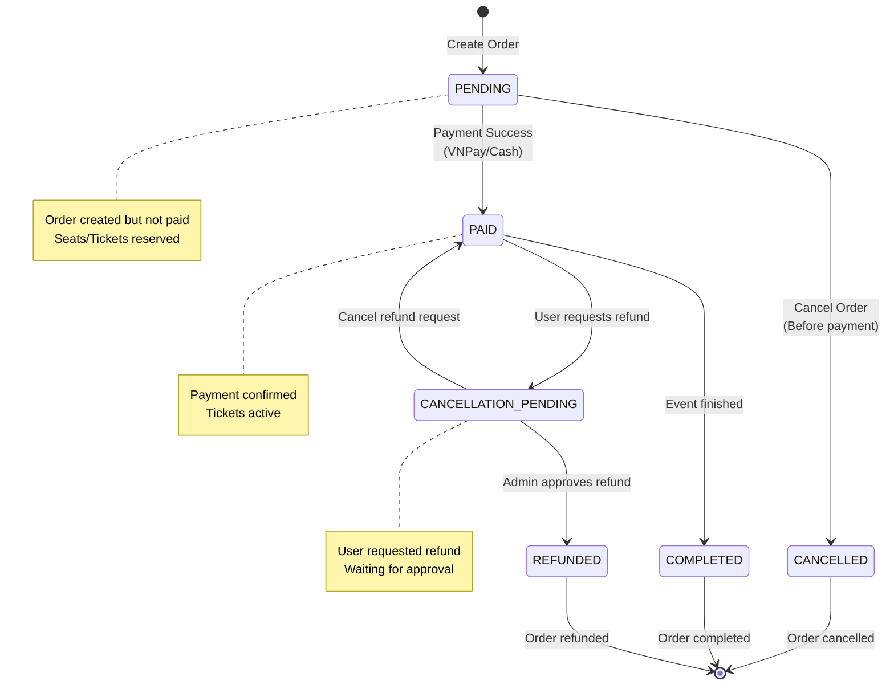
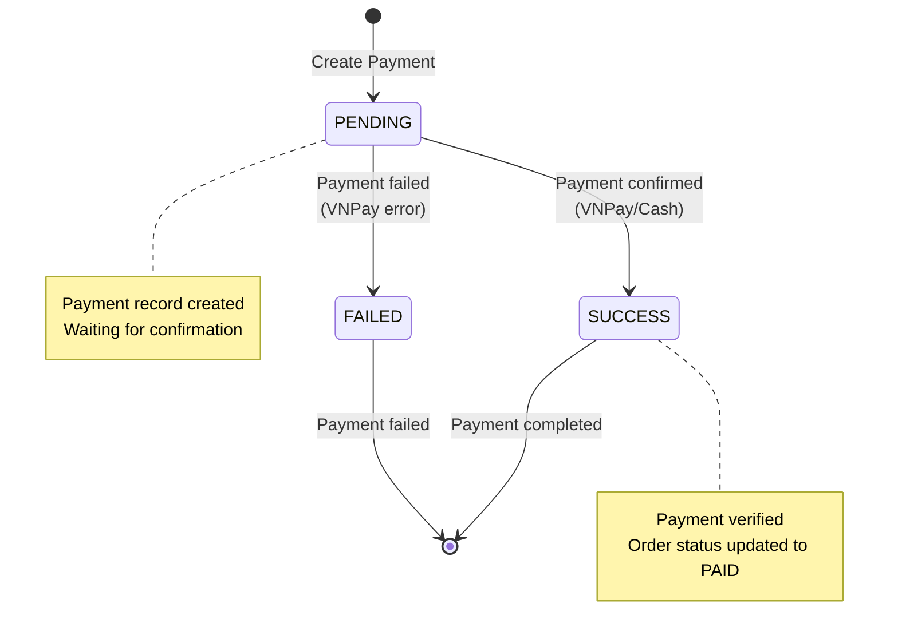

# Ticket Booking System - Workflow Diagrams

Tài liệu này mô tả các workflow chính của hệ thống đặt vé sự kiện bằng Mermaid diagrams.

## 1. Authentication Flow (Luồng Xác Thực)

## 2. Event Booking Flow (Luồng Đặt Vé)

```mermaid
flowchart TD
    Start([Người dùng truy cập trang chủ]) --> Browse[Browse Events]
    Browse --> Filter{Filter Events?}
    Filter -->|Category| Category[Filter by Category]
    Filter -->|Search| Search[Search Events]
    Filter -->|Price Range| Price[Filter by Price]
    Category --> EventList[Hiển thị danh sách Events]
    Search --> EventList
    Price --> EventList
    
    EventList --> SelectEvent[Chọn Event]
    SelectEvent --> EventDetail[Trang Event Detail]
    
    EventDetail --> CheckAuth{Đã đăng nhập?}
    CheckAuth -->|Chưa| Login[Chuyển đến Login]
    Login --> EventDetail
    
    CheckAuth -->|Đã đăng nhập| SelectTickets[Chọn loại vé và số lượng]
    
    SelectTickets --> HasSeatMap{Event có Seat Map?}
    HasSeatMap -->|Có| SelectSeats[Chọn ghế trên Seat Map]
    HasSeatMap -->|Không| NoSeats[Không chọn ghế]
    
    SelectSeats --> SocketConnect[Kết nối Socket.IO]
    SocketConnect --> HoldSeats[Giữ ghế trong 30 phút]
    HoldSeats --> TimerWarning{Còn < 5 phút?}
    TimerWarning -->|Có| ShowWarning[Hiển thị cảnh báo]
    TimerWarning -->|Không| Continue[Tiếp tục]
    ShowWarning --> Continue
    
    NoSeats --> Checkout
    Continue --> Checkout[Trang Checkout]
    
    Checkout --> FillInfo[Điền thông tin khách hàng]
    FillInfo --> ApplyDiscount{Áp dụng mã giảm giá?}
    ApplyDiscount -->|Có| ValidateDiscount[Validate Discount Code]
    ValidateDiscount --> DiscountValid{Mã hợp lệ?}
    DiscountValid -->|Không| DiscountError[Hiển thị lỗi mã]
    DiscountError --> FillInfo
    DiscountValid -->|Có| CalculateTotal[Tính tổng tiền với giảm giá]
    ApplyDiscount -->|Không| CalculateTotal[Tính tổng tiền]
    
    CalculateTotal --> SelectPayment[Chọn phương thức thanh toán]
    SelectPayment --> PaymentMethod{CASH hay VNPAY?}
    
    PaymentMethod -->|CASH| CreateOrderCash[Tạo Order với status PENDING]
    PaymentMethod -->|VNPAY| CreateOrderVNPay[Tạo Order với status PENDING]
    
    CreateOrderCash --> CreatePaymentCash[Tạo Payment record]
    CreatePaymentCash --> OrderCreated[Order created successfully]
    
    CreateOrderVNPay --> CreatePaymentVNPay[Tạo Payment record]
    CreatePaymentVNPay --> CreateVNPayURL[Tạo VNPay Payment URL]
    CreateVNPayURL --> RedirectVNPay[Redirect đến VNPay]
    RedirectVNPay --> VNPayProcess[VNPay xử lý thanh toán]
    VNPayProcess --> VNPayReturn[VNPay return callback]
    VNPayReturn --> VerifyPayment[Verify payment signature]
    VerifyPayment --> PaymentSuccess{Payment thành công?}
    PaymentSuccess -->|Có| UpdateOrderPaid[Cập nhật Order status = PAID]
    PaymentSuccess -->|Không| UpdateOrderCancelled[Cập nhật Order status = CANCELLED]
    
    OrderCreated --> OrderSuccess[Trang Order Success]
    UpdateOrderPaid --> OrderSuccess
    UpdateOrderCancelled --> OrderFailed[Trang Order Failed]
    
    OrderSuccess --> ViewTickets[Xem vé trong Profile]
```

## 3. Order Creation & Payment Flow (Chi Tiết)

## 4. Organizer Event Management Flow

## 5. Admin Management Flow

## 6. Seat Selection & Real-time Updates Flow

## 7. System Architecture Overview

## 8. Database Entity Relationships

## 9. Order Status Flow

## 10. Payment Status Flow

## Tóm tắt các Workflow chính

1. **Authentication Flow**: Đăng ký → Đăng nhập → JWT Token → Protected Routes
2. **Event Booking Flow**: Browse → Select Event → Choose Tickets/Seats → Checkout → Payment → Order Success
3. **Payment Flow**: Create Order → Create Payment → VNPay/Cash → Verify → Update Status
4. **Organizer Flow**: Login → Dashboard → Create/Edit Events → Manage Seats/Tickets → View Orders
5. **Admin Flow**: Login → Dashboard → Manage Users/Events/Orders → View Statistics → Audit Logs
6. **Real-time Seat Selection**: Socket.IO → Seat Reservation → Timer → Auto-release
7. **Order Lifecycle**: PENDING → PAID → COMPLETED/REFUNDED
8. **Payment Lifecycle**: PENDING → SUCCESS/FAILED
